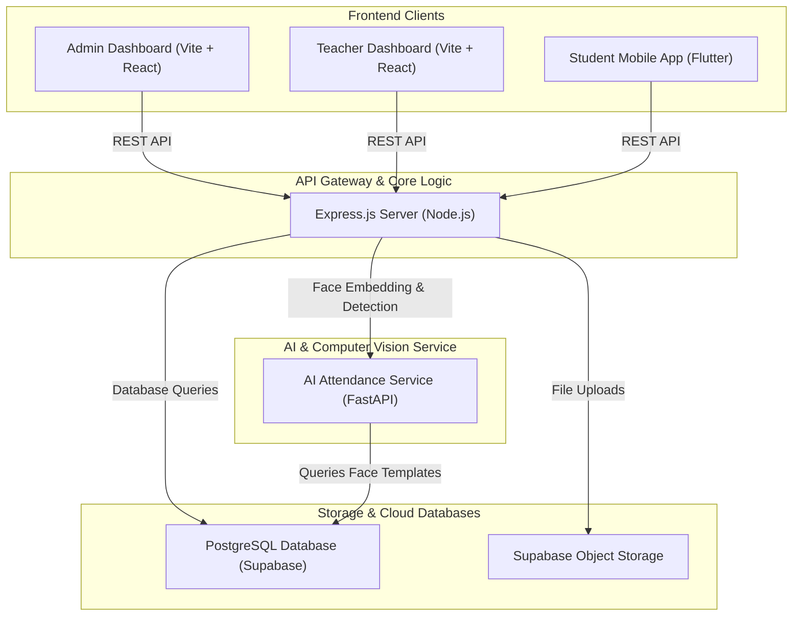
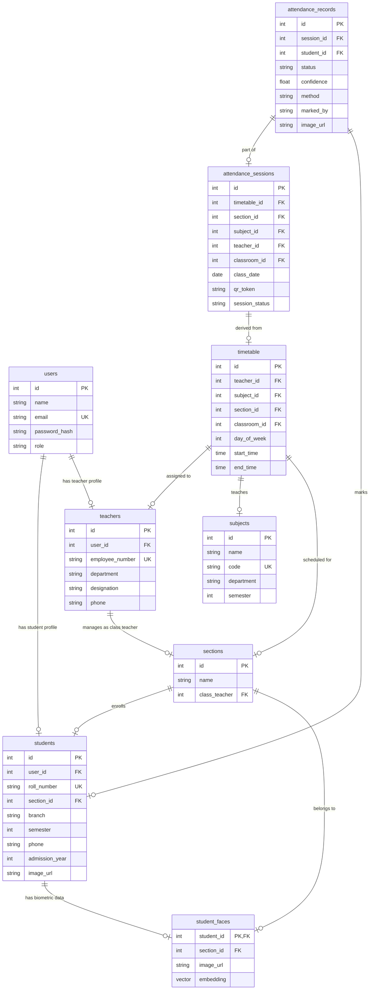

# 🔐 AttendifyAI: Complete Project Overview

Welcome to the comprehensive overview of **AttendifyAI**, an intelligent, multi-factor attendance tracking system that integrates **AI-powered face recognition**, **dynamic QR code scanning**, and **manual verification**. This document details the system architecture, subprojects, database schema, and workflows of the entire application.

---

## 🏗️ System Architecture

AttendifyAI is built on a distributed microservice architecture involving React-based web apps, a Flutter mobile client, an Express.js API gateway, and a specialized Python FastAPI AI service.

---

## 📂 Subprojects Breakdown

The repository is structured into five distinct directories, each serving a specific component of the ecosystem:

| Component | Path | Language / Tech Stack | Purpose |
|---|---|---|---|
| **AI Service** | [Ai_service](file:///Users/punith25/VS-CODE/attendifyAI/Ai_service) | Python, FastAPI, OpenCV, InsightFace, NumPy | Detects faces in images, generates 512-dimension biometric embeddings, and matches detected faces using cosine similarity against stored templates. |
| **Backend API** | [backend](file:///Users/punith25/VS-CODE/attendifyAI/backend) | Node.js, Express, PostgreSQL (pg client), Multer | Core application server handling routing, scheduling, database CRUD operations, session management, and Supabase Storage uploads. |
| **Teacher Dashboard** | [TeacherDashBoard](file:///Users/punith25/VS-CODE/attendifyAI/TeacherDashBoard) | Vite, React.js, TailwindCSS | Web app for lecturers to schedule classes, initiate attendance tracking sessions (AI face-scan, dynamic QR, or manual), and edit records. |
| **Admin Dashboard** | [dashboard](file:///Users/punith25/VS-CODE/attendifyAI/dashboard) | Vite, React.js, TailwindCSS | Web app for administrators to configure institutional metadata (classrooms, subjects, teachers, students, and timetables). |
| **Student Mobile App** | [attendify](file:///Users/punith25/VS-CODE/attendifyAI/attendify) | Flutter (Dart) | Mobile application for students to view timetables, review personal attendance history, register biometric data, and scan classroom QR codes. |

---

## 📊 Database Schema

The database utilizes PostgreSQL (hosted on Supabase) with the following relational schema:

### Table Definitions & Roles
1. **`users`**: General credentials and system access roles (`admin`, `teacher`, `student`).
2. **`students` / `teachers`**: Extended profile information containing institutional IDs (roll number, employee ID), contact details, and department association.
3. **`student_faces`**: Biometric data registry storing a public reference URL of the student's face photo and a 512-dimension vector (`embedding`) generated by the AI service.
4. **`attendance_sessions`**: Active tracker instantiated for a specific lecture.
5. **`attendance_records`**: Logs the status (`present`, `absent`) of each student for a session, capturing the method (`face`, `qr`, `manual`) and confidence levels.

---

## 🔄 Core Workflows

### 1. Student Biometric Registration
To participate in face-recognition attendance, students must register their biometric data:
1. The student uploads a portrait image via the [Student App](file:///Users/punith25/VS-CODE/attendifyAI/attendify) profile screen.
2. The Node.js [backend](file:///Users/punith25/VS-CODE/attendifyAI/backend) uploads the image buffer to Supabase Object Storage under the `Students-faces` bucket and retrieves a public URL.
3. The backend forwards the public URL to the [AI Service](file:///Users/punith25/VS-CODE/attendifyAI/Ai_service)'s `/create-embedding` endpoint.
4. The AI Service loads the image, runs the **InsightFace** model to isolate the primary face, extracts a 512-dimension vector embedding, and returns it.
5. The backend saves the embedding along with the student and section associations to the `student_faces` database table.

---

### 2. AI Face-Recognition Attendance Flow
During a live class:
1. A teacher initiates a face-recognition session in the [Teacher Dashboard](file:///Users/punith25/VS-CODE/attendifyAI/TeacherDashBoard).
2. The dashboard activates the camera, captures a frame, and posts it to the backend's `/api/v1/attendance/frame` endpoint.
3. The backend routes the frame and current class `section_id` to the AI Service's `/detect` endpoint.
4. **Processing in AI Service**:
   - The AI Service queries `student_faces` for all registered students belonging to the target `section_id`.
   - It detects all human faces present in the class frame using OpenCV and InsightFace.
   - For every face in the frame, it calculates the **cosine similarity** between its embedding and the registered student templates.
   - If the similarity exceeds the matching threshold (configured at `0.8`), it resolves the face to the student's ID.
   - It returns the match list along with cropped face images in base64.
5. **Logging & Syncing**:
   - The backend decodes base64 crops, uploads them to Supabase Storage as proof of presence, and registers the matches in `attendance_records` as `present` marked by `ai`.
   - The backend responds with a real-time list of detected students to display on the Teacher Dashboard.
6. The teacher reviews the live detection list, corrects any errors manually, and submits the finalized attendance sheet.

---

### 3. Rotating QR Code Attendance Flow
As an alternative to face-recognition:
1. The teacher begins a QR attendance session. The [Teacher Dashboard](file:///Users/punith25/VS-CODE/attendifyAI/TeacherDashBoard) initiates a dynamic, rotating QR token.
2. The student uses the scanner in the [Student App](file:///Users/punith25/VS-CODE/attendifyAI/attendify) to capture the QR token and send a verification request to `/api/v1/attendance/qr`.
3. The backend validates:
   - If the token matches the active session.
   - If the student is enrolled in the matching session section.
4. If verified, the system inserts/updates the `attendance_records` table marking the student as present.

---

## 🛠️ Tech Stack Directory Map

### 1. Python AI Service: `Ai_service/`
- **Main Entrypoint**: [main.py](file:///Users/punith25/VS-CODE/attendifyAI/Ai_service/main.py)
- **Routers**:
  - [embedding_router.py](file:///Users/punith25/VS-CODE/attendifyAI/Ai_service/Routers/embedding_router.py) (creates face vectors)
  - [detect_router.py](file:///Users/punith25/VS-CODE/attendifyAI/Ai_service/Routers/detect_router.py) (handles live class photo processing)
- **Biometric Logic**:
  - [face_service.py](file:///Users/punith25/VS-CODE/attendifyAI/Ai_service/Services/face_service.py) (initializes InsightFace)
  - [embedding_service.py](file:///Users/punith25/VS-CODE/attendifyAI/Ai_service/Services/embedding_service.py) (validates and pulls face embeddings)
  - [matching_service.py](file:///Users/punith25/VS-CODE/attendifyAI/Ai_service/Services/matching_service.py) (coordinates cosine similarity matching and face cropping)
  - [similarity.py](file:///Users/punith25/VS-CODE/attendifyAI/Ai_service/utils/similarity.py) (cosine similarity utility)

### 2. Node.js Backend: `backend/`
- **Main Server**: [server.js](file:///Users/punith25/VS-CODE/attendifyAI/backend/server.js)
- **Database Connection**: [db.js](file:///Users/punith25/VS-CODE/attendifyAI/backend/Database/db.js)
- **Controllers**:
  - [studentController.js](file:///Users/punith25/VS-CODE/attendifyAI/backend/Controllers/studentController.js) (CRUD and student operations)
  - [studentImageController.js](file:///Users/punith25/VS-CODE/attendifyAI/backend/Controllers/studentImageController.js) (images & embeddings)
  - [aiController.js](file:///Users/punith25/VS-CODE/attendifyAI/backend/Controllers/AttendanceConteollers/aiController.js) (bridges with FastAPI)
  - [qrAttendanceController.js](file:///Users/punith25/VS-CODE/attendifyAI/backend/Controllers/AttendanceConteollers/qrAttendanceController.js) (dynamic token scan)
  - [sessionController.js](file:///Users/punith25/VS-CODE/attendifyAI/backend/Controllers/AttendanceConteollers/sessionController.js) (attendance periods orchestration)

### 3. Frontends
- **Lecturers Dashboard**: [TeacherDashBoard/](file:///Users/punith25/VS-CODE/attendifyAI/TeacherDashBoard)
  - [AttendancePage.jsx](file:///Users/punith25/VS-CODE/attendifyAI/TeacherDashBoard/src/Pages/AttendancePage.jsx) (orchestrates cameras, live detection views, and attendance tables)
  - [AttendanceCamera.jsx](file:///Users/punith25/VS-CODE/attendifyAI/TeacherDashBoard/src/Components/AttendanceCamera.jsx) (streams frames to backend)
- **Admin Dashboard**: [dashboard/](file:///Users/punith25/VS-CODE/attendifyAI/dashboard)
  - Contains management components for system settings, timetables, and teacher/student directories.
- **Mobile Client**: [attendify/](file:///Users/punith25/VS-CODE/attendifyAI/attendify)
  - [Profile.dart](file:///Users/punith25/VS-CODE/attendifyAI/attendify/lib/Pages/Profile.dart) (renders student details and face registration options)
  - [QR_Scaner.dart](file:///Users/punith25/VS-CODE/attendifyAI/attendify/lib/Pages/QR_Scaner.dart) (designed for QR scanning)
