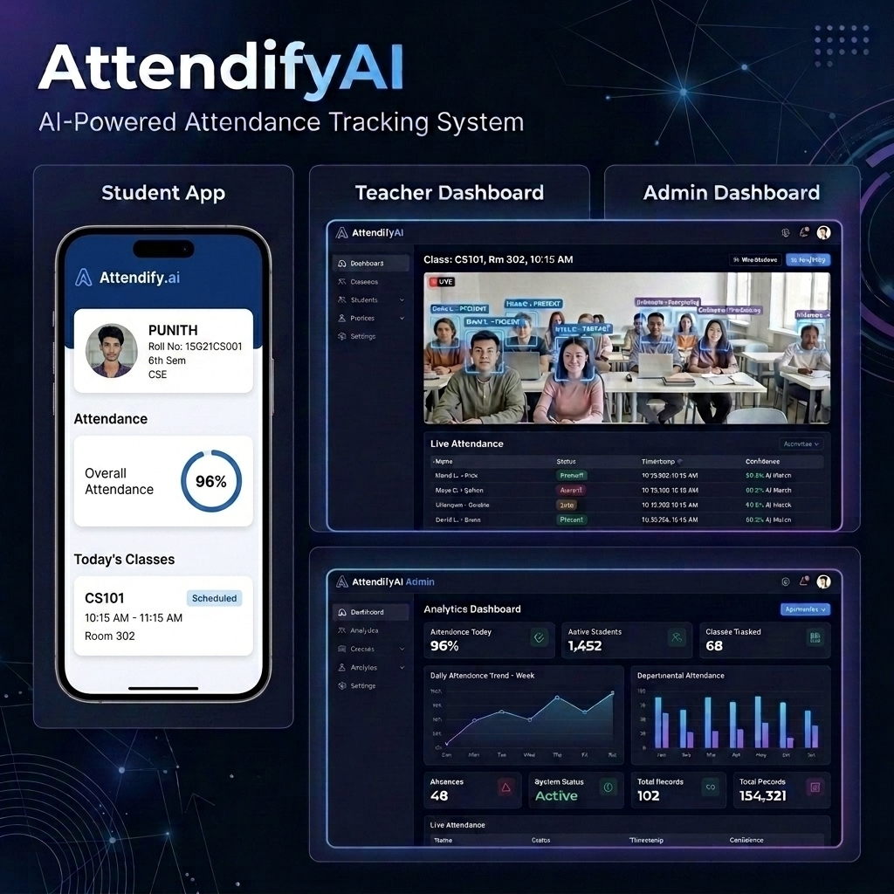

# 🔐 AttendifyAI: AI-Powered Attendance Tracking System

An intelligent, multi-factor attendance tracking system that integrates **AI-powered face recognition**, **dynamic rotating QR codes**, and **real-time management dashboards** for students, teachers, and admins.

---

## 🚀 Features

- 👤 **AI-Based Face Recognition**: Live classroom attendance tracking using OpenCV and InsightFace.
- 📱 **Student Mobile App**: Flutter-based app for QR code scanning, timetable viewing, and biometric registration.
- 👨‍🏫 **Teacher Dashboard**: React-based portal to schedule classes, run live face-scans, and manage student presence.
- 🔑 **Multi-Factor Verification**: Supports credentials, dynamic QR code verification, and face biometric comparison.
- ⚙️ **Admin Dashboard**: Central panel for institutional management, schedules, and database monitoring.
- 💾 **Supabase Integration**: Secure cloud storage for biometric templates and face crops.
- 💾 Secure Database Storage

---

## 🧠 Project Overview

Traditional authentication systems rely only on passwords, which are vulnerable to attacks like phishing, brute force, and hacking.

This project improves security by integrating:
- **Knowledge Factor** → Password
- **Biometric Factor** → Face Recognition

---

## 🛠️ Tech Stack

### Backend
- Python
- FastAPI
- SQLAlchemy

### AI & Processing
- face_recognition
- NumPy

### Security
- bcrypt (password hashing)
- JWT (authentication token)

### Database
- PostgreSQL (Supabase)

### Frontend
- React.js

---

## ⚙️ System Architecture

1. User interacts with frontend
2. Requests sent to FastAPI backend
3. Backend processes authentication
4. Database stores user data & face encoding
5. AI model verifies face
6. JWT token generated on success

---

## 🔄 Workflow

### 📝 Registration
- User enters name, email, password
- Uploads face image
- Face encoding generated
- Password hashed using bcrypt
- Data stored in database

---

### 🔑 Login
- User enters email & password
- System verifies password
- If correct → proceed to face verification

---

### 👁️ Face Verification
- User provides face image
- Encoding generated
- Compared with stored encoding
- If match → login success

---

## 📡 API Endpoints

| Endpoint        | Method | Description |
|----------------|--------|------------|
| `/register`    | POST   | Register new user with face |
| `/login`       | POST   | Verify email & password |
| `/verify-face` | POST   | Perform face authentication |

---

## 🔒 Security Features

- 🔐 Password hashing using bcrypt
- 👤 Biometric face authentication
- 🎟️ JWT token-based sessions
- 🛡️ Multi-factor authentication
- 🔑 Secure data storage

## 📊 Database Schema

The database relies on PostgreSQL (hosted on Supabase). You can find the complete DDL structure in the [schema.sql](file:///Users/punith25/VS-CODE/attendifyAI/backend/Database/schema.sql) file.

### Key Tables:
- **`users`**: General credentials and role definitions (`admin`, `teacher`, `student`).
- **`students` / `teachers`**: Institutional profiles linked to user accounts.
- **`sections`**: Academic batches/classes.
- **`student_faces`**: Stores 512-dimension face vectors/embeddings.
- **`subjects` / `timetable`**: Manages semester curriculum and schedule slots.
- **`attendance_sessions`**: Tracks active period records.
- **`attendance_records`**: Logs live attendance data, confidence levels, capture URLs, and methods.

---

## 📸 Project Interface Preview

Below is a consolidated preview of the AttendifyAI ecosystem, featuring the Student Mobile App, the Teacher Attendance Camera & live table, and the Admin Analytics Dashboard:

---

## ✅ Advantages

- Strong security with multi-factor authentication
- Reduces dependency on passwords
- AI-based identity verification
- Scalable and real-world applicable
- User-friendly interface

---

## ⚠️ Limitations

- Requires good lighting conditions
- Depends on camera quality
- Slight computational overhead
- May fail with face obstructions

---

## 🎯 Conclusion

This project demonstrates how AI can be effectively used in cybersecurity by combining traditional authentication with biometric verification, providing a secure and scalable solution.

---

## 👨‍💻 Team Members
- Punitha K M  
- Aryan Lokesh  
- Darshan K R  
- Sanjay N  

---

## 📌 Future Enhancements

- Add OTP-based authentication
- Improve face recognition accuracy using deep learning
- Deploy on cloud (AWS / Azure)
- Mobile app integration

⭐ If you like this project, give it a star on GitHub!
